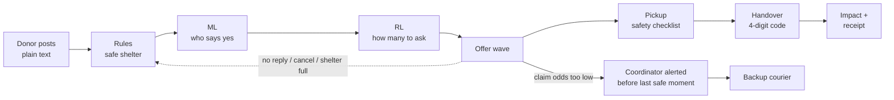
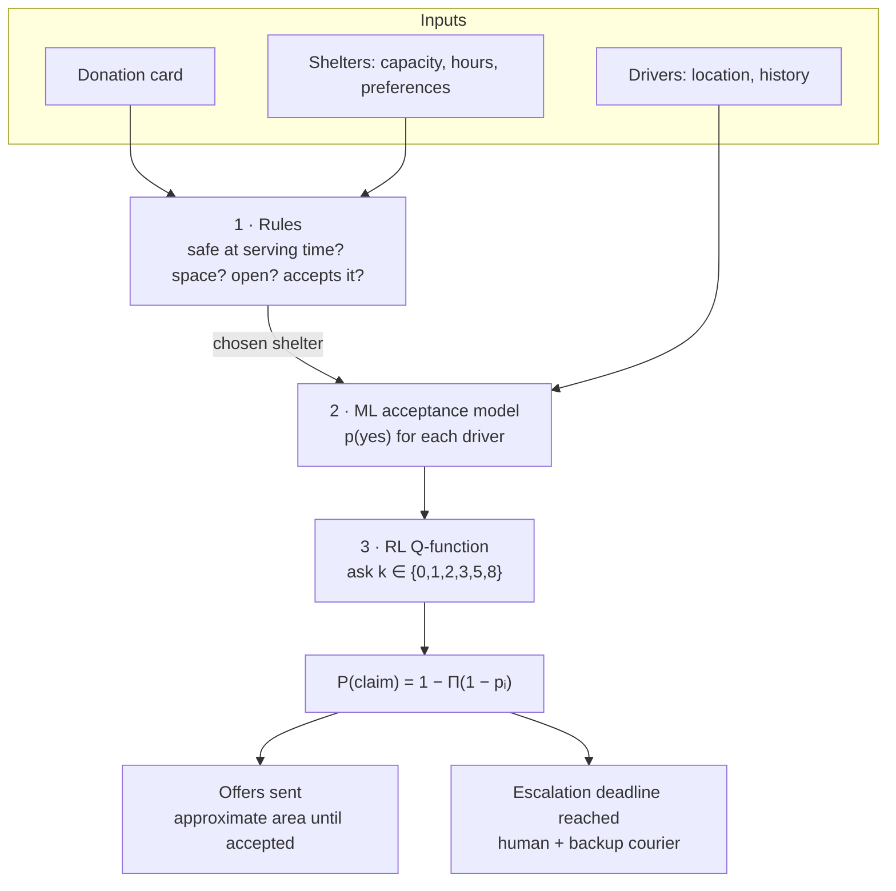
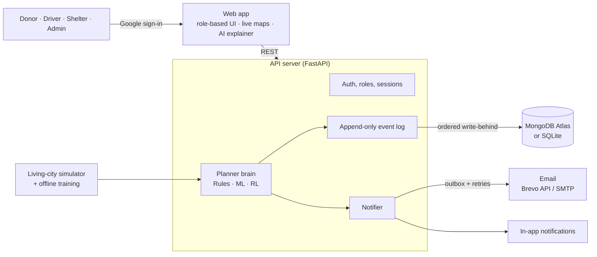
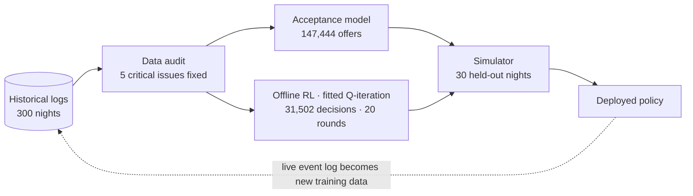

<div align="center">

# Surplus-to-Shelter: Real-Time Food Rescue Routing

### **Relay**: deadline-aware food rescue dispatch

*Turn a restaurant's unsold food into a shelter's next meal, before the food-safety clock runs out.*

**AmiHacks · Track A (NGO / Social Impact) · Problem Statement 1**

</div>

---

## The problem

Restaurants, grocers, caterers and cafeterias throw away edible surplus every day. It isn't that nobody wants the food. There is simply no fast, reliable way to connect *what is available right now, nearby* with *someone who can pick it up and use it before it spoils*. Most surplus has only a **2–6 hour usable window**.

- **How it's done today:** phone calls, spreadsheets and WhatsApp groups. This breaks down at scale and under time pressure.
- **No capacity view:** shelters can't tell anyone how much food they can take tonight.
- **No records:** there's no trail for impact reporting, CSR or tax documentation.
- **A trust gap:** donors can't be sure the food was picked up safely and actually used.

### The real bottleneck

Finding a recipient is largely solved: a commercial platform reports a **99% match rate** (Copia). What fails is **getting a person to commit in time**. In the best public data, from 412 Food Rescue (4,574 rescues), **16.4% were never claimed or were claimed only in the final hour**.

> Volunteers are not employees. You can't *dispatch* them; you can only *ask*. They can say no, not reply, or accept and then cancel.

Every rescue has to fit inside three windows at once:

| Clock | Question |
|---|---|
| 🛡️ Food safety | Will the food still be safe **when it is served**? (4 h for cooked food under the FDA Food Code time rule) |
| 🍽️ Donor | When does the restaurant close and need the food gone? |
| 🏠 Shelter | Is it open, does it have space, and does it accept this food? |

---

## Proposed solution

**Relay** is a dispatch co-pilot for food-rescue organisations. It connects four kinds of people:

- **Donors:** restaurants, food-chain outlets, kiosks, caterers, bakeries, grocers, hotels, campus dining;
- **Volunteer drivers;**
- **Shelters and community kitchens;**
- **Coordinators.**

Relay treats food rescue as **reliability engineering for a perishable, time-windowed delivery system run by people who can say no**.

For every donation it:

1. **Reads a plain-language post** such as *"30 plates veg biryani, kept hot, we close 11"* and turns it into a structured donation card in about 0.1 s.
2. **Starts a rule-based safety clock.** It never uses a prediction for safety.
3. **Picks a shelter that can safely serve the food.** It checks capacity, receiving hours, food type and veg-only preferences, and fairness. Every shelter it rules out gets a stated reason.
4. **Predicts which drivers will say yes,** using a calibrated machine-learning model.
5. **Decides how many drivers to ask, and when,** using a reinforcement-learning policy. Asking too few risks losing the food; asking too many burns volunteers out.
6. **Re-plans** every 8 minutes, and immediately when a driver cancels, a shelter fills up or new food is posted.
7. **Alerts a coordinator before the last safe moment**, with a one-click backup courier, rather than in the final hour.
8. **Proves the handover** with a 4-digit code that only the shelter holds, then records the impact and issues the donor a printable receipt.

---

## How it works

### End-to-end flow



### Decision pipeline



**Design principle:** safety is always a rule and never a model. ML predicts people, and RL only decides how large each wave of offers is.

### System architecture



- **Event-sourced.** Every change is an immutable event, so the whole city can be rebuilt by replaying the log. That log is also the audit trail that food-donation records require.
- **Fast.** The working state is kept in memory, so web requests never wait on the database. One ordered background writer persists each change and retries after network failures.
- **Role-secure.** Every API route checks the user's role and whether they own the data. Sessions are random tokens stored only as hashes, in HttpOnly SameSite cookies.

### How the AI learned



- **Reward:** meals rescued minus 0.02 for every notification sent.
- **Training is offline, on purpose.** The policy never changes itself in the middle of a shift.
- **Data audit first.** Before training anything, we audited the provided dataset and repaired 5 issues:
  - times were stored relative to posting;
  - reinforcement-learning rewards were aligned to the wrong steps;
  - behaviour-cloning labels were empty;
  - one feature leaked the answer (an oracle feature);
  - a time flag was computed on the wrong clock.

---

## Core features

| 🍲 Food donor | 🛵 Driver | 🏠 Shelter | 🛡️ Coordinator (admin) |
|---|---|---|---|
| Post surplus in about 30 s from plain text | Online / offline switch | Free space per food type | Live board, most urgent first |
| Live 5-step tracker and map | Offers only when you're a good fit | "Full" switch, veg-only, confidential address | Claim-odds ring and escalation deadline per rescue |
| Email at every step | Exact address shown only after accepting | Incoming food with a handover code | One-click backup courier |
| Printable donation receipt (CSR / tax) | Pickup checklist (temperature, packing) | Handover history | **How Relay thinks**: animated AI explainer |
| Personal impact dashboard | Maps links and a thank-you email | Email alerts | Simulation lab, impact export, system health, mailbox |

**Notifications:** every key moment creates an in-app 🔔 notification and an email for exactly the people involved.

| Moment | Donor | Driver | Shelter |
|---|---|---|---|
| Posted | ✓ | | |
| Driver asked | | Offer (approximate area only) | |
| Driver accepts | Driver name and pickup time | Pickup and drop-off addresses with maps | **Handover code** |
| Picked up | ✓ | | ✓ with code |
| Delivered | ✓ with receipt | Thank-you with meals delivered | Handover confirmed |

- The handover code proves delivery, so it goes **only** to the shelter.
- A confidential shelter's address is never sent to a driver.
- Each person can turn email off in their settings.

---

## Innovation and uniqueness

1. **Serve-time safety.** A shelter is chosen only if the food will still be safe *when that shelter serves it*, not just when it arrives.
2. **Ask, don't dispatch.** A calibrated probability for each volunteer means Relay sends *just enough* offers to reach the claim odds it needs.
3. **Reinforcement learning where it earns its place.** RL decides only how many drivers to ask and when. That halved notifications compared with our rules-only planner.
4. **Early escalation.** An explicit latest-safe-escalation time alerts a human while the food can still be saved.
5. **Trust by design.** A handover code, a pickup checklist, receipts and an append-only audit log.
6. **Explainable AI.** An animated, narrated walkthrough (with a presenter mode) shows each live decision: which rules passed or failed, each driver's predicted odds, the RL agent's scores, the reward, and how the agent learned.

---

## Results

Measured on **30 held-out nights** of real Bengaluru donation streams, drivers and shelters, which no model saw during training. Every policy ran on the same random events.

| Metric | WhatsApp-style broadcast | 412-style static rule | Relay (rules) | **Relay + RL** |
|---|---|---|---|---|
| Food rescued | 76.6% | 93.5% | 88.8% | **89.6%** |
| Driver pings per rescue | 145.1 | 65.9 | 25.0 | **12.7** |
| Pings to the busiest drivers (p95) | 38.6 | 31.4 | 9.7 | **8.5** |
| Food lost (kg per night) | 117.2 | 32.2 | 51.2 | **48.4** |
| Food-safety violations | 0 | 0 | 0 | **0** |

**Against a broadcast:**
- 13 percentage points more food rescued;
- 91% fewer pings;
- 59% less food lost;
- 78% fewer pings to the most-asked volunteers.

**Against the static rule:** 5× fewer pings, for 3.9 percentage points less food. That's a burnout trade-off, and it's adjustable.

| Model quality | Value |
|---|---|
| Acceptance model AUC | **0.786**, against an oracle ceiling of 0.787 |
| Calibration error (ECE) | **0.005**: when it predicts 30%, about 30% say yes |
| Behaviour-cloning accuracy | 70%, against 43% for always predicting the most common choice |
| Planner latency (p95) | about 15 ms; donation matched in about 60 ms |

> ⚠️ **These results come from simulation, not the field.** The simulator replays the dataset's real donation streams and its measured driver behaviour. A field result needs a pilot.

---

## Technology

| Layer | Technology |
|---|---|
| Backend | Python, FastAPI, Uvicorn |
| AI / ML | scikit-learn: logistic acceptance model, gradient-boosted fitted Q-iteration, behaviour cloning; pandas, PyArrow |
| Data | MongoDB Atlas (or SQLite), event-sourced |
| Identity | Google Identity Services (OAuth 2.0) |
| Notifications | In-app notifications; email through the Brevo HTTPS API or any SMTP server, with an outbox and retries |
| Maps | Leaflet with CARTO basemaps |
| Frontend | HTML, CSS and JavaScript; SVG and Web Animations API |
| Language intake | Rule-based parser, plus an optional Claude LLM used for extraction only |
| Deployment | Docker on Render, MongoDB Atlas, Brevo; all on free tiers |

---

## Feasibility and viability

**Feasible today**
- It's a working product: 25 end-to-end checks, 8 storage and notification tests, and 7 safety and replay property tests all pass.
- It runs in about 215 MB of memory with **no GPU**, entirely on free tiers.
- It keeps working when a piece is missing:
  - without MongoDB, it stores data in local SQLite;
  - without an email service, emails are kept as previews;
  - if drivers don't respond, a backup courier is one click away.

**Viable to scale** (proposed plan)
- **Pilot:** a 6-week *shadow mode* pilot with a campus dining hall and one NGO chapter. Relay recommends; humans decide.
- **Pricing:** free for NGOs, shelters and volunteers. Food chains and hotels pay for verified ESG / CSR impact reports.
- **Expansion:** city by city. A new city needs its own configuration, not new code.

---

## Impact

| Who | Benefit |
|---|---|
| People facing food insecurity | About 16% more meals delivered, safely *(simulated)* |
| Restaurants and chains | A 30-second donation, no disposal hassle, receipts for their records |
| Volunteers | Far fewer unnecessary pings, which means less burnout |
| Shelters | Only food they can actually serve in time, and control over what arrives |
| Environment | Less surplus food ending up in landfill |
| Government and ESG teams | An audit-ready record of every rescue: kg, meals, times and safety checks |

**Aligned with UN Sustainable Development Goals:**
- SDG 2: Zero Hunger;
- SDG 12.3: halve food waste;
- SDG 13: Climate Action.

---

## Getting started

```bash
pip install -r requirements.txt
```

```bash
python app.py
```

Open **http://localhost:8000**. One-click demo accounts let you try each role immediately, and everyone who isn't signed in is simulated, so the city keeps moving.

| Guide | Covers |
|---|---|
| [DEMO.md](DEMO.md) | Setup, running, testing every problem-statement capability, the live demo and the pitch |
| [INTEGRATIONS.md](INTEGRATIONS.md) | MongoDB, email (SMTP / Brevo) and notifications |
| [DEPLOY.md](DEPLOY.md) | Free public deployment (Render + MongoDB Atlas + Brevo) |
| [GUIDE.md](GUIDE.md) | The data audit, ML and RL models: training, evaluation and tuning |

---

## Scope and limitations

- Multi-stop routing for drivers covering several pickups isn't built yet. Each rescue is one pickup and one drop-off.
- Travel times use straight-line distance with a road factor, not a live routing engine.
- Notifications are in-app and email. SMS and WhatsApp are natural next channels.
- Environmental impact (CO₂e) is shown only when a cited emission factor is configured.

---

<div align="center">

**Relay makes sure surplus food reaches a plate while it's still safe to eat.**

</div>
